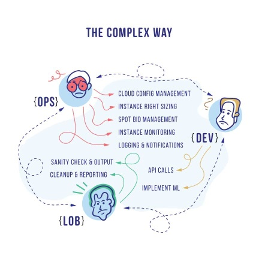
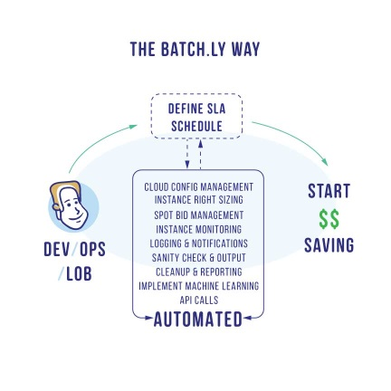

#### Why Batchly?
        	
Batch.ly is a solution that fully automates AWS cost management (using spot instances and instance rightsizing using autoscaling) in a way that makes the ROI impossible to ignore.

AWS has 11 regions with 2 to 3 AZ’s in each region and 50 instance types and many instance categories (like Spot, Reserved, On-demand). Identifying the right infrastructure for your application/s from these options is a non trivial activity. It is complex, costly and most times suboptimal.

Batchly takes out all the complexities associated with Cloud management by automating all the activities resulting in up to 90% reduction in AWS costs. 

#### Why Batchly Benefits You

Batchly enables both internet and traditional enterprises to automatically benefit from AWS cost and usage savings by optimizing workloads with spot instances and EC2 smart sizing. No matter what you use AWS for, Batchly helps you to reduce your cost (by up to 90%) in a frictionless manner.

Features that customers love:

* AWS Spot Bid Optimization Seamlessly deploy, move, and manage workloads over high cost savings spot instances across any AWS region.
* EC2 Instance Smart Sizing Realize ultimate EC2 efficiencies with the automatic instance sizing for the right application / workload.
* Seamless Integration Easily work with pre-built apps for most common enterprise applications (JMeter, Spark, Hive, PIG, Jenkins, Elastic BeanStalk and more) and REST API support provides a seamless experience.
* Fully Managed Benefit from cost and utilization optimizations from within your own AWS account while we do the heavy lifting.
* Secure We solved security with organic and strong AWS security controls.