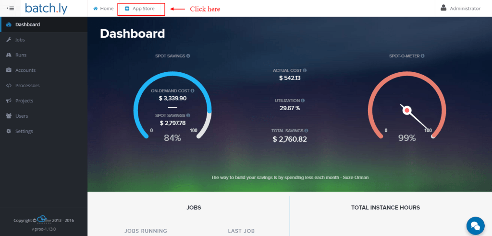
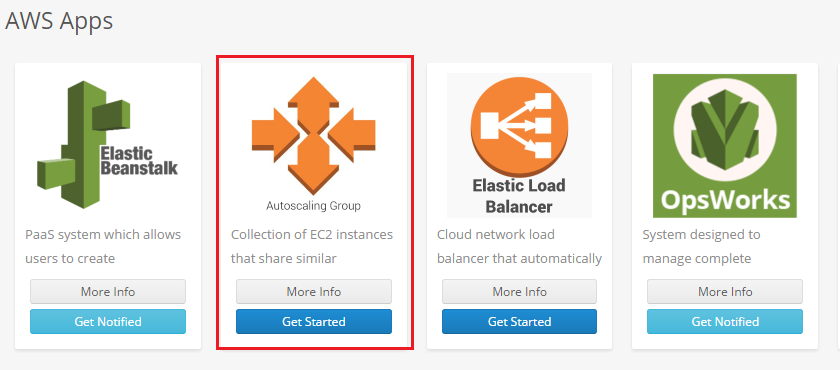
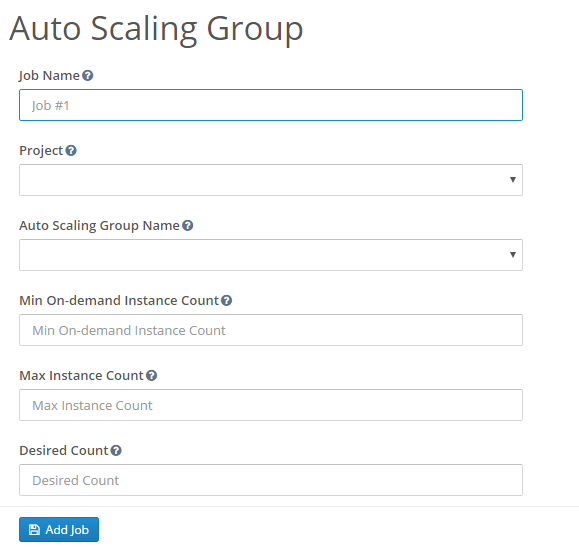
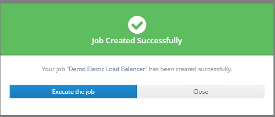

### Getting started with AWS Auto Scaling using Batchly

AWS Auto Scaling helps you maintain application availability and allows you to scale your Amazon EC2 capacity up or down automatically according to conditions you define. With Batchly App for Auto Scaling, you can now run your AWS Auto Scaling groups through Batchly and bring down your EC2 costs significantly with the usage of right spot instances without compromising on your application availability. 

**Step 1:**  Login to your Batchly Console Application (your-domain.batchly.net) using registered Email Id and Password.

**Step 2:** You will be redirected to Batchly Dashboard. Next, click on the App Store located in the header.

**Step 3:** You will be redirected to the **App store** which has the apps supported on Batchly. To run Elastic Load Balancer app, click the Get Started button.

**Step 4:** Now, to run Auto Scaling job, fill all the required given text fields. There are following text fields to be filled:

**Job Name:** You can give any desired name to your job.

**Project:** Select the associated project to run the job. The project is associated with VPC and Region in which the job has to run.

**Auto Scaling Group name:** Select the AWS Auto Scaling group from the drop down.

**Min OnDemand instances:** Specify the AMI ID to be used to launch instancesSpecify the minimum number of ondemand instances that should run as part of the Auto Scaling group.

**Max Instance Count:** Specify the maximum number of instances that should run as part of the Auto Scaling group.

**Desired Count:** Specify the desired number of instances. Auto Scaling ensures that your group has this many instances.

**Step 5:** Click on the **Add Job** button once you are done with filling all the details. This action will save your job and is available to see later on the ‘Jobs’ page.

**Step 6:** On successful job addition, you would get a popup where you can either start your job immediately (by clicking ‘Execute the Job’) or schedule your job to run later (by clicking on the button ‘Schedule the Job’).

**Step 7:** You can monitor the job progress using the Job Run Details page.
