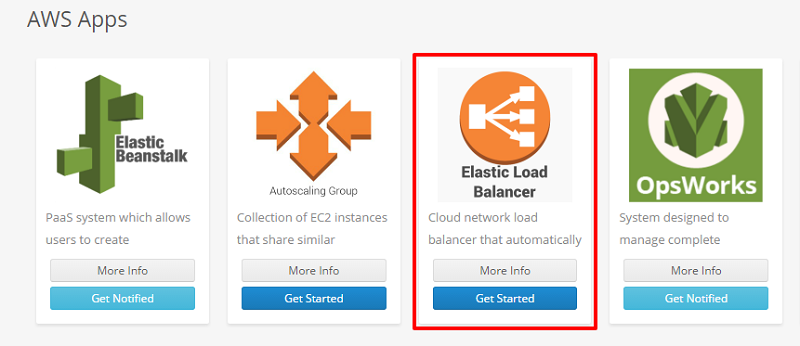

### Let's get started with Batchly Elastic Load Balancer

**Step 1:**  Login to your Batchly Console Application (your-domain.batchly.net) using registered Email Id and Password.

**Step 2:** YYou will be redirected to Batchly Dashboard. Next, click on the App Store located in the header.

**Step 3:** You will be redirected to the **App store** which has the apps supported on Batchly. To run Elastic Load Balancer app, click the Get Started button.

**Step 4:** Now, to run Elastic Load Balancer job, fill all the required given text fields. There are following text fields to be filled:

**Job Name:** You can give any desired name to your job.

**Project:** Select the associated project to run the job. The project is associated with VPC and Region in which the job has to run.

**Elastic Load Balancer:** Select the Elastic Load Balancer from the drop down.

**AMI ID:** Specify the AMI ID to be used to launch instances.

**Security Group:** Specify the security group to be associated with instances.

**Launch script:** Specify the user data script to be used while launching the instances.

**Instance Type:** Specify the instance type to be used to launch instances.

**Max Instance Count:** Specify the maximum number of instances that should run as part of the autoscaling group.

**Desired Count:** Specify the desired number of instances.

** Scaling Rules:** Specify the metric on which the to scale, upper threshold , lower threshold and scale down factors. 

**Step 5:** Click on the **Add Job** button once you are done with filling all the details. This action will save your job and is available to see later on the ‘Jobs’ page.

**Step 6:** On successful job addition, you would get a popup where you can either start your job immediately (by clicking ‘Execute the Job’) or schedule your job to run later (by clicking on the button ‘Schedule the Job’).

**Step 7:** You can monitor the job progress using the Job Run Details page.