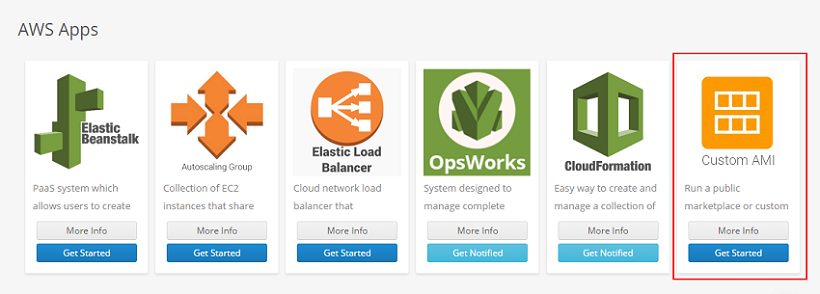
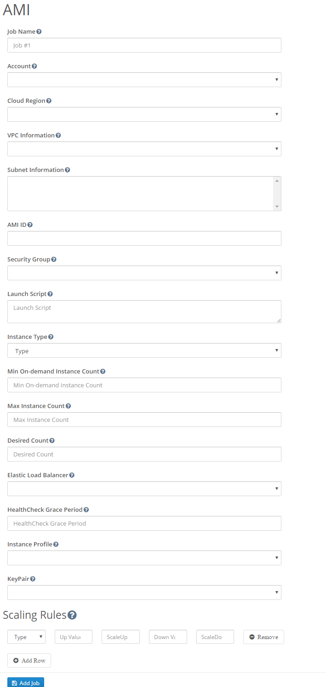

### Getting started with AWS Custom AMI using Batchly

**Step 1:** Login to your Batchly Console Application (your-domain.batchly.net) using registered Email Id and Password.

**Step 2:** You will be redirected to Batchly Dashboard. Next, click on the App Store located in the header.

**Step 3:** You will be redirected to the **App store** which has the apps supported on Batchly. To run Custom AMI app, click the **Get Started** button.

**Step 4:** Now, to run Custom AMI job, fill all the required given text fields. There are following text fields to be filled:

**Job Name:** You can give any desired name to your job.

**Account:** Select your AWS Account where you want to run the job.

**Cloud Region:**  The Cloud region will be selected automatically. 

**VPC Information:** If the Account has VPC associated with it, then it will get selected automatically.You can also select the desired VPC.

**Subnet Information:** If the Account has VPC associated with it, then it will get selected automatically.You can also select the desired number of subnet out of all. 
*Note:* By-default, all the subnet will be taken.

**AMI ID:** Specify the AMI ID to be used to launch instances.

**Security Group:** Specify the security group to be associated with instances.

**Launch script:** Specify the user data script to be used while launching the instances.

**Min On-demand Instance Count:**  Specify the minimum number of on-demand instances that should run as part of the Custom AMI environment.

**Max Instance Count:** Specify the maximum number of instances that should run as part of the Custom AMI environment.

**Desired Count:** Specify the desired number of instances. Auto Scaling ensures that your group has this many instances.

**Elastic Load Balancer:** Select the ELB, if you want to include it.

**HealthCheck Grace Period:** Specify the grace period. (It will be taken in seconds, *For Example:* 30)

**Instance Profile:** Select the Instance Profile type.

**Key Pair:** Select the Key Pair.

**Scaling Rule:** Specify the metric on which the to scale, upper threshold , lower threshold and scale down factors.

**Step 5:** Click on the **Add Job** button once you are done with filling all the details. This action will save your job and is available to see later on the ‘Jobs’ page.

**Step 6:** On successful job addition, you would get a popup where you can either start your job immediately (by clicking ‘Execute the Job’) or schedule your job to run later (by clicking on the button ‘Schedule the Job’).

**Step 7:** You can monitor the job progress using the Job Run Details page.
