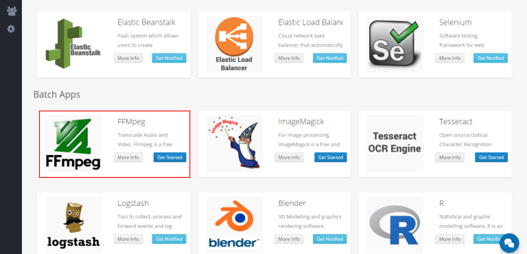
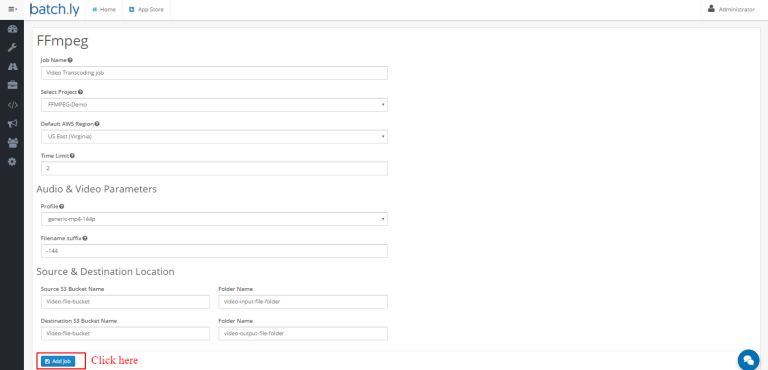
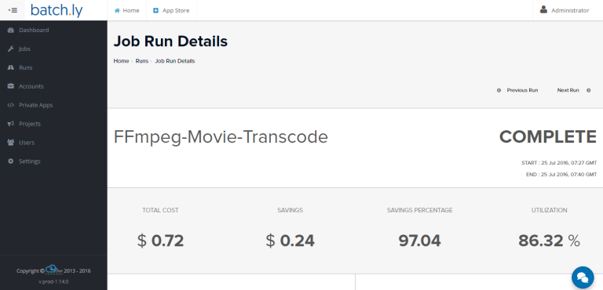

### Let's get started with FFmpeg

**Step 1:**  Login to your Batchly Console Application (your-domain.batchly.net) using registered Email Id and Password.

**Step 2:** You will be redirected to Batchly Dashboard. Next, click on the **App Store** located in the header.

**Step 3:** You will be redirected to the App store which has the apps supported on Batchly. To run JMeter, click the **Get Started** button in the FFmpeg App.

**Step 4:** Now, to run FFmpeg job, fill all the required given text fields. There are following text fields to be filled:

**Job Name:** You can give any desired name to your job.

**Project:** Select the associated project to run the job.

**Default AWS Region:** Select the AWS region.

**Time Limit:** Give the time limit to run a job in hours.

**Profile:** Select the profile type in which you want to transcode.

**Filename Suffix:** Give any desired suffix to differentiate input file from the output file.

**Source S3 Bucket Name:** Give the Amazon S3 bucket Bucket name.

**Folder Name:** Give the folder name, if available.

**Destination S3 Bucket Name:** Give the Amazon S3 Bucket name.

**Folder Name:** Give the folder name, if available.

**Step 5:** Click on the ‘Add Job’ button once you are done with filling all the details. This action will save your job and is available to see later on the ‘Jobs’ page.

**Step 6:** On successful job addition, you would get a popup where you can either start your job immediately (by clicking ‘Execute the Job’) or schedule your job to run later (by clicking on the button ‘Schedule the Job’).

**Step 7:** You can monitor the job progress using the Job Run Details page.

