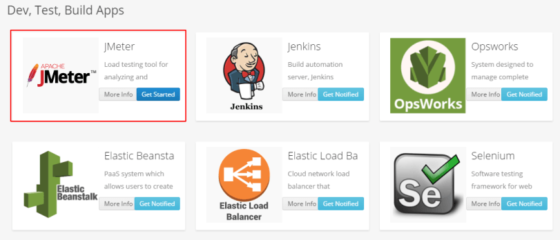

### Let's get started with JMeter

**Step 1:**  Login to your Batchly Console Application (your-domain.batchly.net) using registered Email Id and Password.

**Step 2:** You will be redirected to Batchly Dashboard. Next, click on the **App Store** located in the header.

**Step 3:** You will be redirected to the App store which has the apps supported on Batchly. To run JMeter, click the **Get Started** button in the JMeter App.

**Step 4:** Now, to run JMeter job, fill all the required given text fields. There are following text fields to be filled: 

1. **Job Name:** You can give any desired name to your job.

2. **Project:** Select the associated project to run the JMeter job.

3. **Test Plan:** Upload the JMeter test plan (JMX file) from your local system which you want to execute.

4. **Output Location:** Give the Amazon S3 bucket output location.

5. **Instance Count:** Give the number of instance on which you want to run your test job.

6. **Instance Type:** Select the Amazon EC2 instance type on which you want to run your test plan.

**Step 5:** Click on the ‘Add Job’ button once you are done with filling all the details. This action will save your job and is available to see later on the ‘Jobs’ page.

**Step 6:** On successful job addition, you would get a popup where you can either start your job immediately (by clicking ‘Execute the Job’) or schedule your job to run later (by clicking on the button ‘Schedule the Job’).

**Step 7:** You can monitor the job progress using the Job Run Details page.

