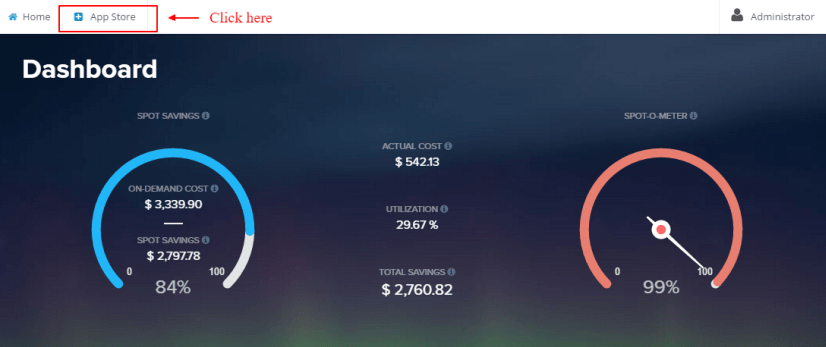
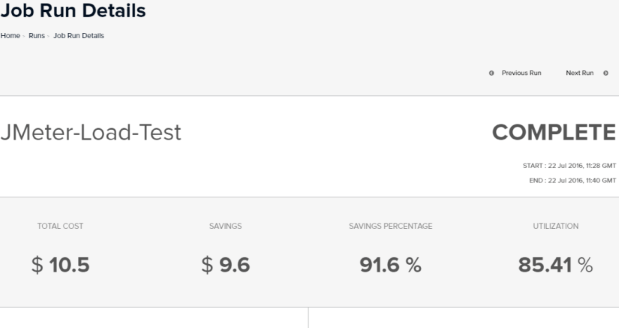

### Getting started with Batchly JMeter

**Step 1:**  Login to your Batchly Console Application (your-domain.batchly.net) using registered Email Id and Password.

**Step 2:** You will be redirected to Batchly Dashboard. Next, click on the **App Store** located in the header.

**Step 3:** You will be redirected to the App store which has the apps supported on Batchly. To run JMeter, click the **Get Started** button in the JMeter App.

**Step 4:** Now, to run JMeter job, fill all the required given text fields. There are following text fields to be filled: 

**Job Name:** You can give any desired name to your job.

**Account:** Select your AWS Account where you want to run the job.

**Cloud Region:**  The Cloud region will be selected automatically. 

**VPC Information:** If the Account has VPC associated with it, then it will get selected automatically.You can also select the desired VPC.

**Subnet Information:** If the Account has VPC associated with it, then it will get selected automatically.You can also select the desired number of subnet out of all. 
*Note:* By-default, all the subnet will be taken.

**Test Plan:** Upload the JMeter test plan (JMX file) from your local system which you want to execute.

**Output Location:** Select the Amazon S3 bucket output location.

**Instance Count:** Give the number of instance on which you want to run your test job.

**Instance Type:** Select the Amazon EC2 instance type on which you want to run your test plan.

**Step 5:** Click on the ‘Add Job’ button once you are done with filling all the details. This action will save your job and is available to see later on the ‘Jobs’ page.

**Step 6:** On successful job addition, you would get a popup from where you can start your job immediately (by clicking ‘Execute the Job’).

**Step 7:** You can monitor the job progress using the Job Run Details page.

