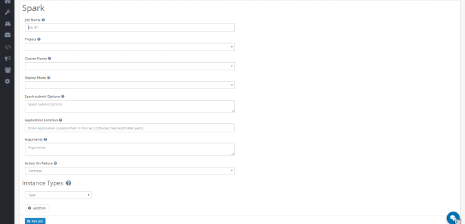
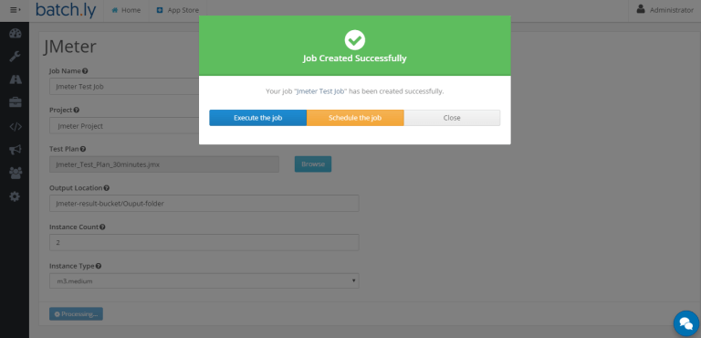

### Getting started with Big Data Apps

Big Data has following apps which are almost similar to each other in term of using it (or information required to run these apps): 
*Hive*, *Pig*, *Spark*, *Hadoop*

This demonstration will show on how to use Spark app.You may select any other Big data app instead of Spark.(since , all these apps are similar)

**Step 1:**  Login to your Batchly Console Application (your-domain.batchly.net) using registered Email Id and Password.

**Step 2:** You will be redirected to Batchly Dashboard. Next, click on the **App Store** located in the header.

**Step 3:** You will be redirected to the App store which has the apps supported on Batchly. To run Spark, click the **Get Started** button in the Spark App.

**Step 4:** Now, to run Spark job, fill all the required given text fields. There are following text fields to be filled: 

**Job Name:** You can give any desired name to your job. 

**Project:** Select the associated project to run the job.

**Cluster Name:** Select the cluster name. 

**Deploy Mode:** Select the deploy mode.

**Spark-submit Options:** Enter Spark-submit if you have any.

**Application Location:** Enter Application Location.

**Arguments:** Enter Arguments if you have any.

**Action on Failure:** Select the Action on Failure.

**Instance Type:** Select the Instance Type

**Step 5:** Click on the **Add Job** button once you are done with filling all the details. This action will save your job and is available to see later on the **Jobs** page.

**Step 6:** On successful job addition, you would get a popup where you can either start your job immediately (by clicking **Execute the Job**) or schedule your job to run later (by clicking on the button **Schedule the Job**).

**Step 7:** You can monitor the job progress using the **Job Run Details** page.

