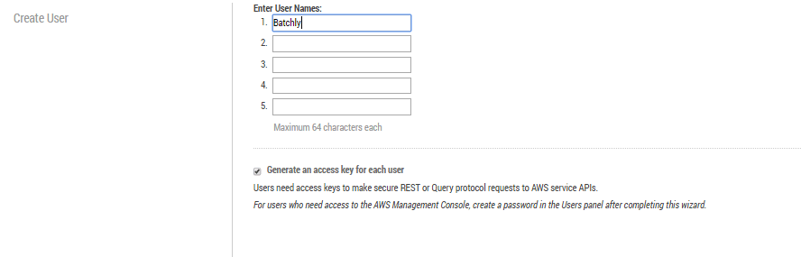
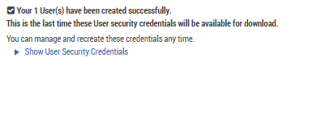
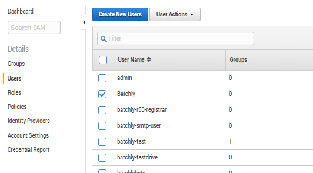
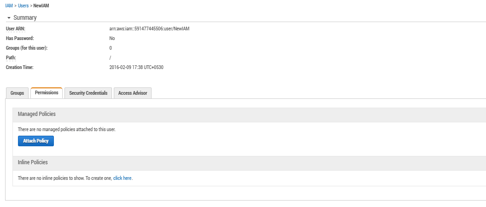
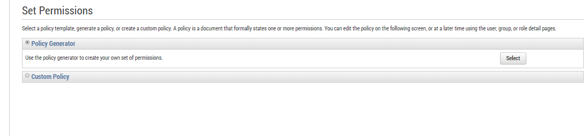
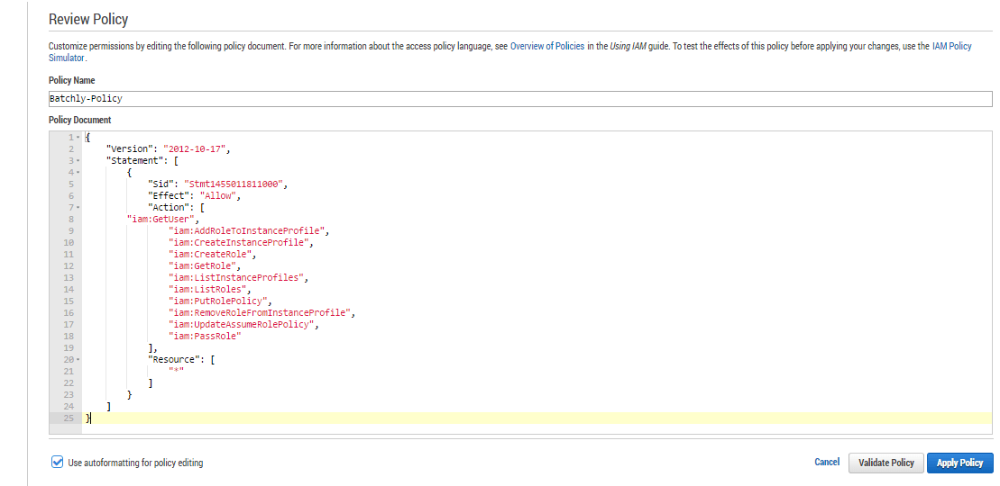

### Steps to create IAM Access

Batchly provides an easy way to add your AWS account. All it needs is for you to provide your AWS Master Key and Access Key, and Batchly automatically creates a separate IAM access with privileges to launch EC2 instances (Spot and On-demand), as well as monitor them.

However, if for some reason you don’t want to provide your AWS keys, you can create an IAM user for Batchly by following the steps given below:

1. Go to AWS IAM dashboard

2. In the left hand pane, click on user.

3. Give the user a name, then select Generate to give an access key to each user and click Create.



Download the credentials. At the bottom right corner, there’s a download credentials button.



In the Users listing, click on the user and in the next screen at the bottom, click on Inline Policies.





Select Custom Policy and it opens up a policy editor. Give the policy a name, such as  Batchly-Policy, and add the policy below.






```
{
    "Version": "2012-10-17",
    "Statement": [
        {
            "Sid": "Stmt1455011811000",
            "Effect": "Allow",
            "Action": [
                "iam:GetUser",
                "iam:AddRoleToInstanceProfile",
                "iam:CreateInstanceProfile",
                "iam:CreateRole",
                "iam:GetRole",
                "iam:ListInstanceProfiles",
                "iam:ListRoles",
                "iam:PutRolePolicy",
                "iam:RemoveRoleFromInstanceProfile",
                "iam:UpdateAssumeRolePolicy",
                "iam:PassRole",
                "iam:GetInstanceProfile"
            ],
            "Resource": [
		"arn:aws:iam::XXXXXXXXXXXXX:role/batchly/"
                "arn:aws:iam::XXXXXXXXXXXXX:role/batchly/batchly-trusted-role",
		"arn:aws:iam::XXXXXXXXXXXXX:instance-profile/*"
		"arn:aws:iam::XXXXXXXXXXXXX:policy/batchly-access-policy",
		"arn:aws:iam::XXXXXXXXXXXXX:user/USERNAME"
            ]
        }
    ]
}
```

**Note:** In the JSON, replace the XXXXXXXXXXXXX with the account number of the account in which you are creating the user. Replace the USERNAME with the username in the above policy statement.

Next, apply the policy and use the credentials to add the AWS account in Batchly.

Please execute the above steps and share the credential information with us. This would enable us to add the role. The permission list clearly specifies the permission expected for adding the new role.

Once the account is added in Batchly, you can safely remove the user. In addition, once the account is added, you can also validate the newly added role and its permission list.