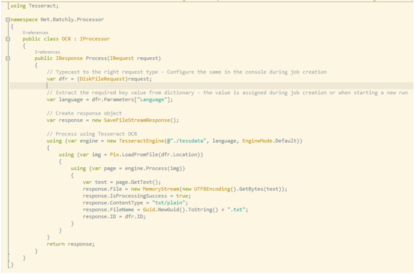

This section provides the necessary information for processing files using an OCR like Tesseract.

### Data Source
Batchly currently supports maintaining Image files in S3.  You can specify a bucket and a folder as data source.  Batchly enumerates the entire folder to get the list of files and begins processing.

### Interface Model 

Tesseract has a nugget package for use within .Net systems which makes it extremely easy to build processors for Batchly. Here’s the steps for creating a new processor

1. Create a new class library project

2. Using Package Manager, add the tesseract nuget package

3. Add reference to the Net.Batchly.Extension dll

4. Create a new class and implement the IProcessor Interface

5. Write how a single file is processed within the Process method.

The following image shows a simple processor for Batchly written using the tesseract engine.

### Script Model 

If you wish to create a script for processing, Batchly supports the following method. Create a script that accept a json file that contains all the input information, invoke a library like Tesseract and send back a json response post processing.

