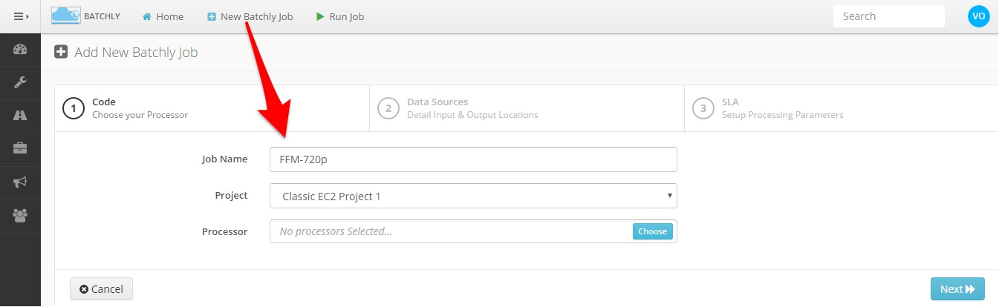
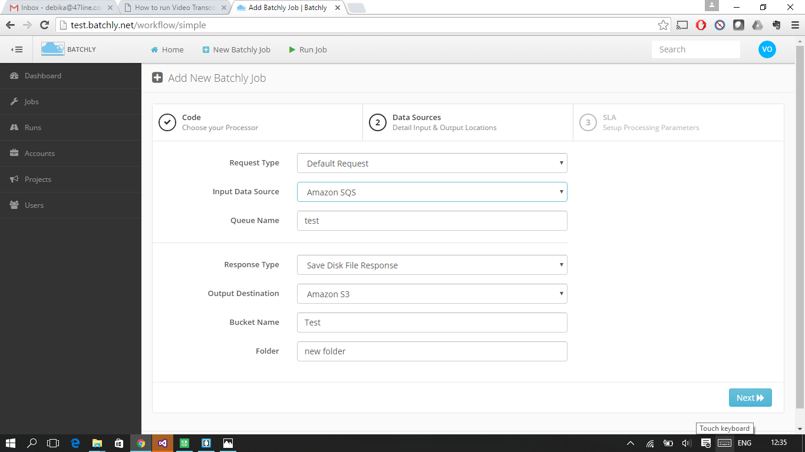
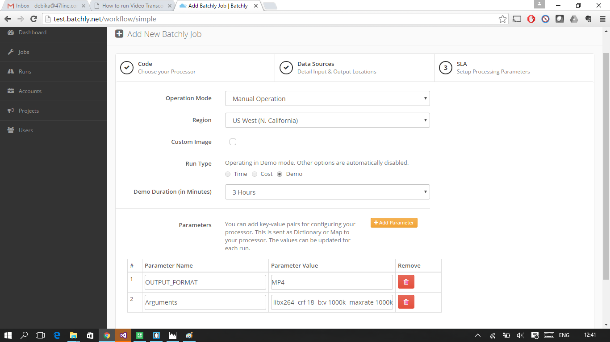
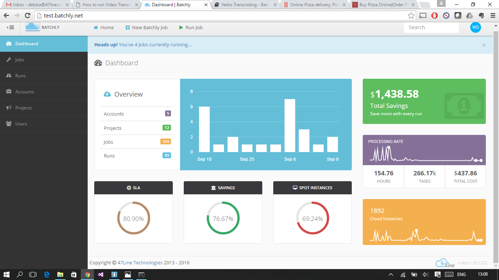

#### How To Run Video Transcoding (FFMpeg) Jobs In AWS Using Batchly

Video processing (transcoding, encoding, transsizing) workloads are extremely resource hungry and often require high CPU server farms which are complex to run and maintain. Instead of making these capex investments which will only be utilized Batchly can be used to run these jobs as per schedule or on-demand at a fraction of the cost.

This article we look at how easy it is to setup and run your transcoding job on Batchly. For this example, we will encode 10 files of varying sizes (totalling 16 GB) into 720p HD resolution with an SLA of 7 hours (Side note: Core tenet of Batchly is the SLA model – You set the time, cost or both and Batchly strictly adheres to it)

**Step 0:** For the purpose of this article, we assume the raw files to be in Amazon S3. If you have it in-house or in another hosting provider, it can be synced to S3 using scripts or third party file uploaders like Asphera which is outside the purview of this article.

**Step 1:** Select “New Batchly Job” in the topbar. Enter a job name, select a project and Batchly FFMpeg Processor. FFMpeg is a popular open source solution to resize & convert a host of audio and video formats.

**Step 2:** Enter the input and output sources. In this case, the files are present in “bucket-name” under a folder called “folder” and outputs would be put into “output-folder”.

**Step 3:** Choose “Manual Operation” or “Scheduled Operation”. For this test, we will choose manual operation to start the job instantly. FFMpeg requires two arguments: OUTPUT_FORMAT and Arguments. Since we are converting the raw files to 720p MP4, use the following

**OUTPUT_FORMAT:** .MP4

**Arguments:** -codec:v libx264 -crf 18 -b:v 1000k -maxrate 1000k -bufsize 1835k -vf scale=-2:720 -threads 0 -codec:a copy

**Note:** The arguments variable internally sends the value to the ffmpeg command

**Step 4:** Save and start the job.

During the processing you can go back to the Monitor Run screen to check the progress. Once the run is completed, Batchly provides a comprehensive report about the run. This can be accessed by clicking on “Runs” in the left side bar and click the “Summary” button on the run you want to review.

#### Run Summary

