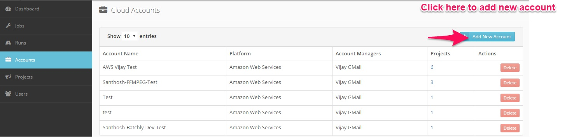
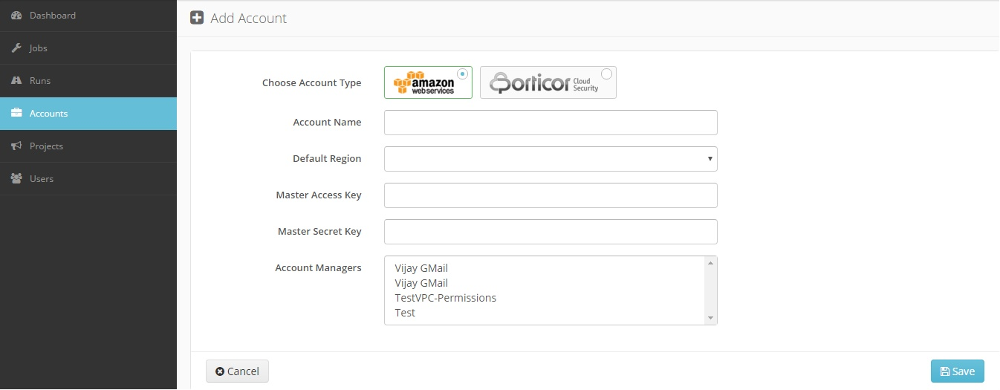

### Add AWS Account 
Before adding an account customer need to have their own AWS account. The following steps will demonstrate how to add an account:

1.Click the **Accounts** link in the left sidebar.

2.**Account Type:** Add a new AWS account to batchly.

3.**Account Name:** A name to identify the account.

4.**Default Region:** Specify the default AWS region you want to operate in.

![Account] (../img/rrr.png)

5.**Access Key:** Provide the AWS Access key.

6.**Secret Key:** Provide the AWS Secret key of the corresponding Access Key.    

7.**Account Manager:** Assign a project manager for the project.

![Account] (../img/mng.png)
