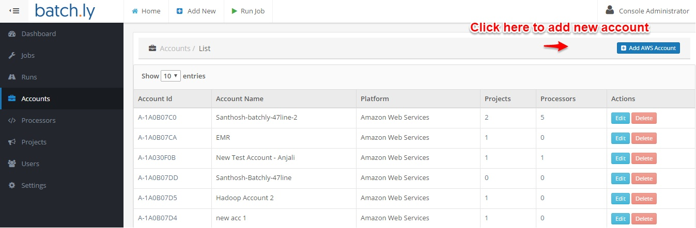
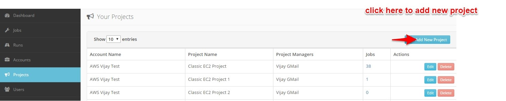
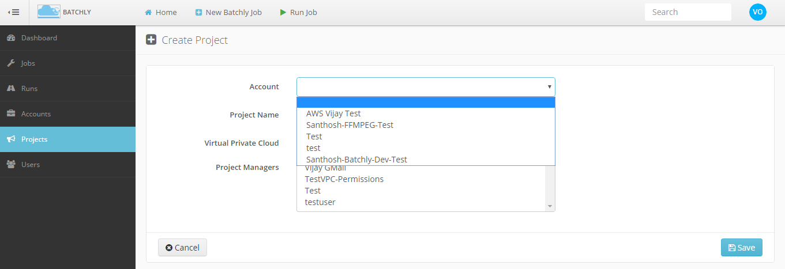
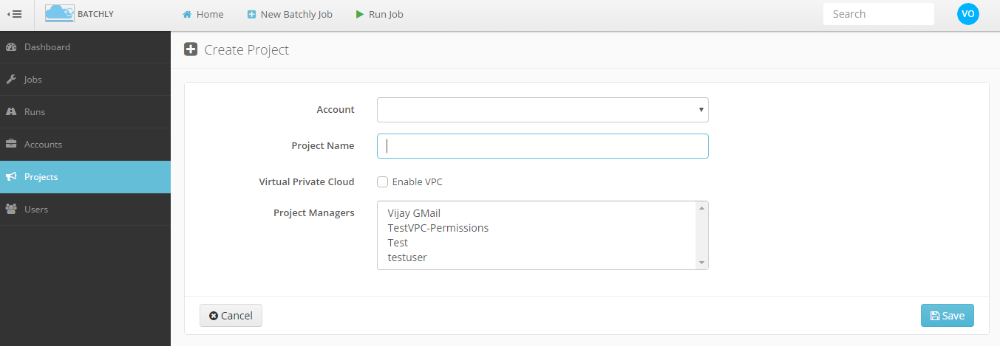
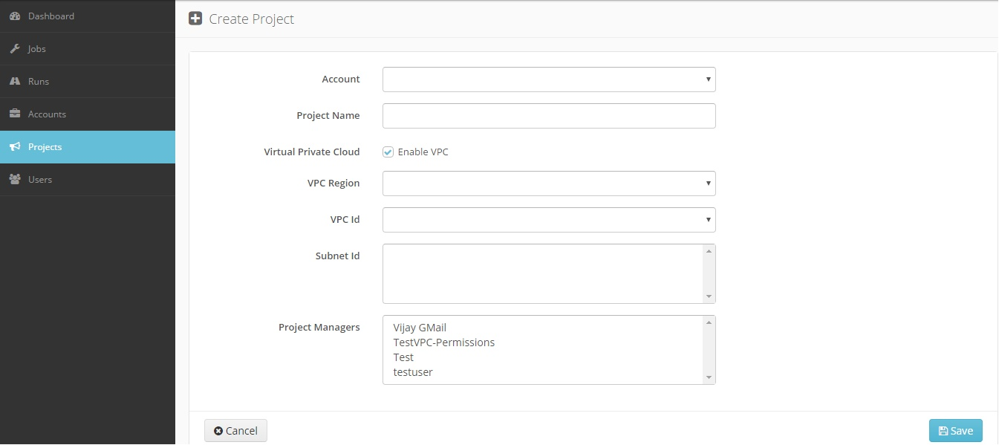
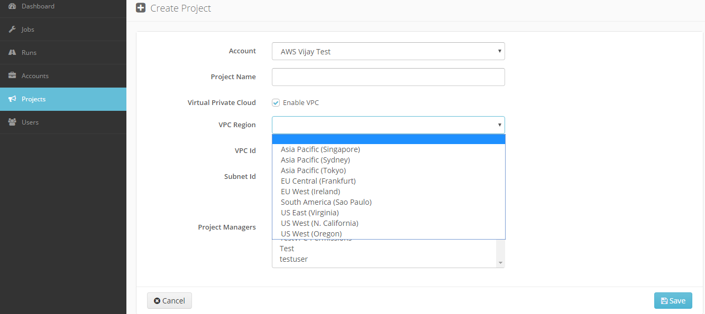
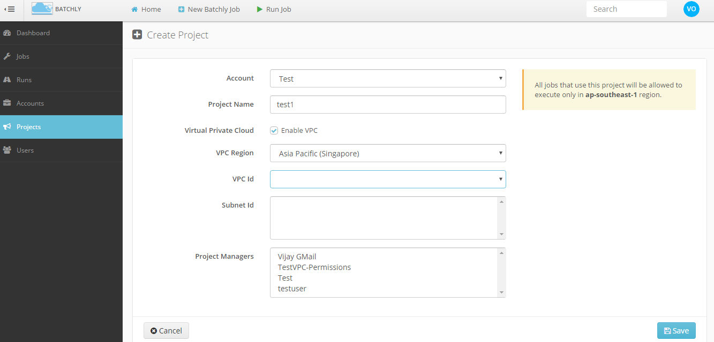
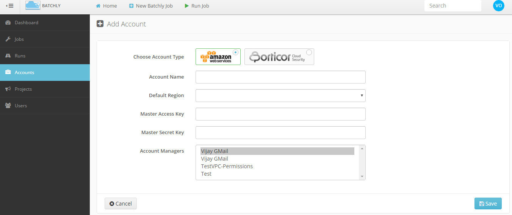

### Getting Started

#### Add AWS Account

Click the Accounts link in the left sidebar. Here you provide a name for your account, specify the default AWS region you want to operate in and the access and secret keys for your account. (Before adding an account customer need to have their own AWS account.)

The following steps will demonstrate how to add an account:

1.Click the **Accounts** link in the left sidebar.

2.**Account Type:** Add a new AWS account to batchly.

3.**Account Name:** Select a name to identify the account.

4.**Default Region:** Specify the default AWS region you want to operate in.

![Account] (../img/rrr.png)

5.**Access Key:** Provide the AWS Access key.

6.**Secret Key:** Provide the AWS Secret key of the corresponding Access Key.    

7.**Account Manager:** Assign a project manager for the project.

![Account] (../img/mng.png)

#### Create new project

The projects section lets you add a project under an AWS account. In the following steps will show how to add a new project to Batchly:

 1.Select **project** link in left sidebar and Click on **Add New Project**.
 
 
 
 2.**Account:** Identifier of the Account in which the project resides.
 
   
 
 3.**Name:** Enter the Name of project.
 
  
     
 4.You can ensure that it runs within your VPC by clicking the Enable VPC checkbox and assign it to team member from this section
 
   
 
 5.**VPC Region:** Set the AWS region where project need to be run.

   
    
 6.**VPC Id:** Enter the VPC Id.
 
    
    
 7.**Subnet Id:** Enter the subnet Id.

 8.**Project Manager:** Assign a project manager for the project.

   
     