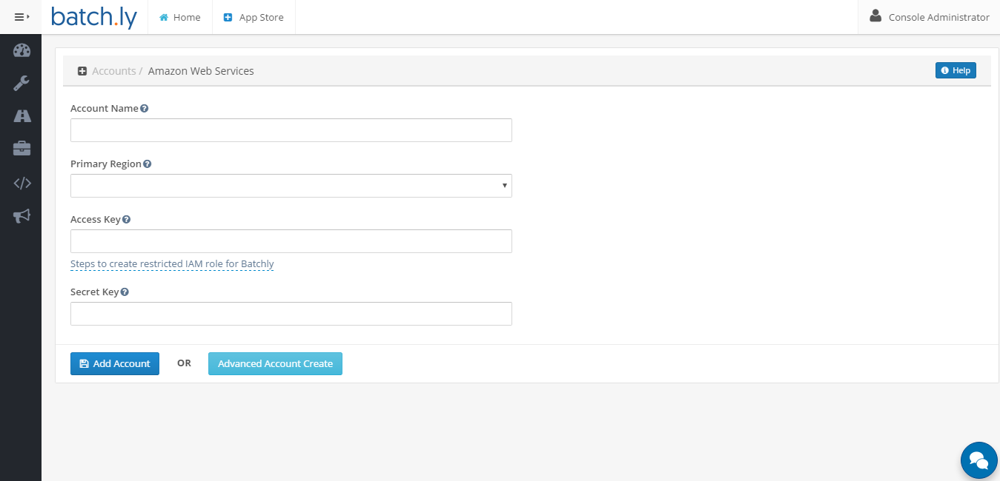

### Getting Started

To get started with Batchly, go to the [Registration page](https://join.batchly.net) and **create a new Batchly Account**.

To Register for Batchly, enter the following details :

1. Enter your **Full Name**

2. Enter your **Organization Name**

3. Enter your Organization Name or any desired name to set **domain name**

4. Enter your valid **Email Address**

5. Enter your valid **Phone Number**

6. Enter your **Password**

7. Click **Create Account** button.You may be asked to select the Captcha to let us know that you are human.

### First step after signing up - Check your Email

After signing up, you will receive an email on your registered email address for verification. After verification completion, you can successfully sign in to Batchly.

### Sign in Process - Wizard

When you sign up for the very first time from your customized domain (for example : http:// yxz.batchly.net), you will go through the Wizard page. Here you will be asked to follow a few steps in order to set up everything, which you will be required to use on an app later.

**Step 1:** Create an account.

**Step 2:** Create a project.

**Step 3:** Select any app.

#### Add AWS Account

Click the **Add AWS Account** and you will be redirected to another page where following details needs to be given to add an account.

1. Enter Account Name.

2. Select the Region.

3. Enter your Access Key.

4. Enter your Secret Key.

**Note:** Before adding an account, the customer needs to have their own AWS account.

#### Add Project

**Important:** 

1. Before adding a project, the customer needs to have their own AWS account.
          
2. When you create an account, a default project will be created without VPC. So, creating a project is not mandatory. This can be done later.

The projects section lets you add a project under an AWS account. The following steps will show how to add a new project:

1. Enter Project Name.

2. Select the Account under which you want to add the project.

3. Select the Cloud region.

3. Select the **Virtual Private Cloud**. (This is optional)
**Note:** If you wish to work on **JMeter** app then this VPC will be mandatory.

4. Select the VPC information. (This needs to be done only if you have selected VPC)

5. Select the subnet information. (This needs to be done only if you have selected VPC)

### Select App

Once you're done with adding account and project, you can select any app you want to work on.

