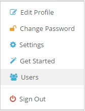
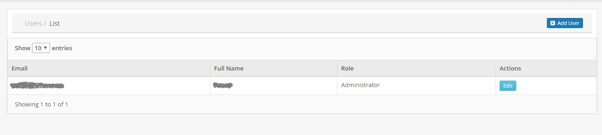
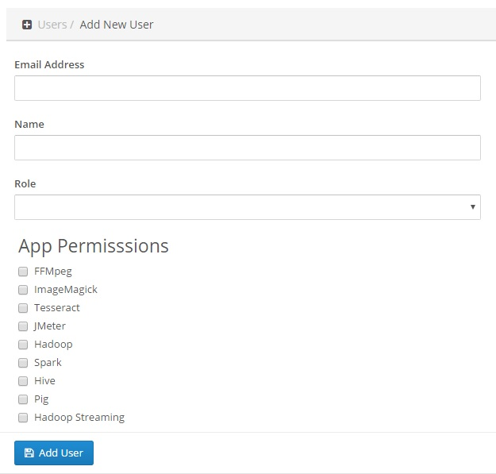

### Change Password

You can change your Batchly password at anytime.

1. Sign in to your Bacthly account.

2. Click on the name given on the top-right corner.

3. Select **Change Password**.

### Edit Profile Settings

You can change your profile settings ( **Email**, **Name**, **Role** ) at any time.

1. You can click on the name given on the top-right corner from the header.

3. Select **Edit Password**.

### Settings

From the settings, you can generate **API Keys**. Also, you can **revoke** those keys when not required.

1. You can click on the name given on the top-right corner from the header.

2. Select **Settings**.

### Users **(For Administrator Account Only)**

As Administrator in Batchly, you have permissions to add and delete your colleagues. He/She can also restrict or permit access to specific apps in Batchly.

**Note:** By default, all users have access to all apps in Batchly.

To remove app permissions for a specific user, follow the below steps:

1. Go to Users screen, from the Profile link in the top header.

2. In the Users screen, click "Add User" button.

3. In the "Add User" screen, go to "App Permissions" section, check the Apps you want to give access to and click "Add User".

This will create a new user, with access to specific apps.

