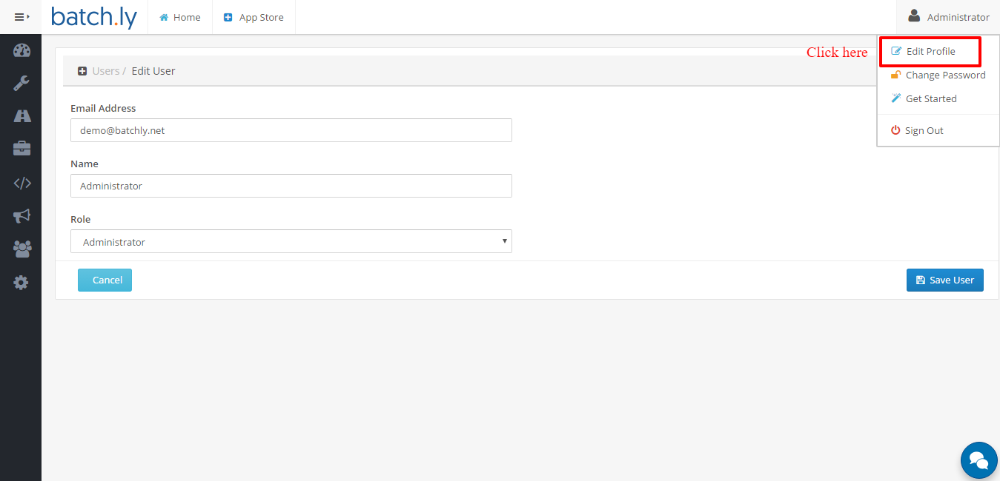

### Change Password

You can change your Batchly password at anytime.

1. Sign in to your Bacthly account.

2. Click on the name given on the top-right corner.

3. Select **Change Password**.

### Edit Profile Settings

You can change your profile settings ( **Email**, **Name**, **Role** ) at any time.

1. You can click on the name given on the top-right corner from the header.

3. Select the **Edit Password**.

### Settings

From the settings, you can generate **API Keys**. Also, you can **revoke** those keys when not required.

1. You can click on the name given on the top-right corner from the header.

2. Select the **Settings**.

